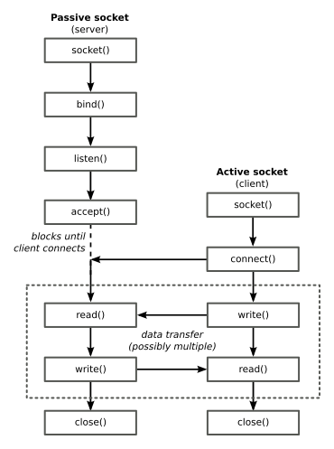

Apuntes de las prácticas de *sockets* (**ApTel**)
=================================================

# Servidores secuenciales

Los servidores secuenciales son los servidores más sencillos, generalmente los encontramos en servicios que se prestan por UDP (con sockets de tipo SOCK_DGRAM), pero también los podemos encontrar en servicios TCP (con sockets de tipo SOCK_STREAM).

Puedes refrescar la diferencia entre pasivos y activos así como las llamadas al API aquí introducción a sockets. El ciclo de vida de las aplicaciones que utilizan sockets pasivos es el siguiente:

1. Crear el socket (socket).
2. Configurar el socket (estructura sockaddr_in, función getaddrinfo).
3. Asociarlo con un puerto (bind).
4. Convertir el socket en un socket pasivo para prepararlo para recibir onexiones entrantes (listen).
5. Extraer una de las conexiones entrantes en espera y asociarla a un nuevo socket (accept).
6. Lectura/escritura (read/write) o recibir/enviar (recv/send).
7. Cierre del socket y liberación de la conexión (close).
8. Volver al estado de espera de conexiones.

# Servidores concurrentes

La diferencia fundamental con los servidores secuenciales es que los concurrentes arrancan un nuevo proceso (fork) o hilo de ejecución (pthread_create) para dar servicio a las conexiones que se van recibiendo.

Como se puede ver en la Figura 1, un proceso tiene su propia zona de memoria, mientras que los hilos de ejecución (threads) comparten la misma zona de memoria y los recursos. La elección de uno u otro depende de las ventajas y desventajas que aportan cada uno de ellos, pero pueden ser usados indistintamente (por ejemplo, en esta práctica utilizaremos procesos, pero podríamos utilizar hilos).

Otras estrategias que utilizan los servidores de alto rendimiento incluyen tener servidores prearrancados entre los que van distribuyendo las peticiones según van llegando, para evitar el tiempo de espera hasta que se crea el hilo o proceso. Por lo general, los servidores TCP son concurrentes, para poder servir simultáneamente a varios clietnes (y los servidores UDP secuenciales).

# Entrada/Salida I/O (manejadores de señales, mecanismos de polling, select)

## Entrada/salida bloqueante y no bloqueante

Las operaciones de entrada/salida son por lo general bloqueantes y esto también ocurre cuando se utilizan con sockets. Esto implica que cuando se realiza alguna de estas operaciones sobre un socket, el proceso pasa al estado dormido, esperando que se satisfaga alguna condición que permita que se complete la operación. Así:

	- Si realizamos operaciones de entrada (read, recv, recvfrom...) sobre un socket TCP y no hay datos disponibles en el buffer de recepción del socket, el proceso pasa a estado dormido hasta que lleguen datos.

	- Si realizamos operaciones de salida (write, send, sendto...) sobre un socket TCP, cuando nosotros realizamos esta llamada, el kernel copia los datos del buffer de la aplicación en el buffer de envío del socket; si no queda espacio en este buffer, el proceso se bloquea hasta que haya suficiente espacio.

En muchas ocasiones es recomendable emplear algún mecanismo que nos permita realizar estas operaciones de forma no bloqueante y así poder realizar otras tareas en vez de esperar a que los datos estén disponibles. En esta práctica vamos a ver algunos de los mecanismos que existen para poder realizar operaciones de entrada/salida no bloqueantes sobre sockets, en concreto, los mecanismos de polling y los mecanismos asíncronos.

## La función fcntl() y los mecanismos de polling

La función fcntl() es una función de control que nos permite realizar diferentes operaciones sobre descriptores (de ficheros, de sockets,...) en general. El prototipo de la función es el siguiente:

	#include <fcntl.h>
	int fcntl(int fd, int cmd, /* int arg*/);

Cada descriptor tiene asociado un conjunto de flags que nos permiten saber o conocer ciertas características del descriptor. Para obtener el valor de estos flags, se realiza una llamada a fcntl() con el parámetro cmd al valor F_GETFL. De un modo similar cuando queremos modificar el valor de los flags, se utiliza el valor F_SETFL.

Se recomienda ver detalladamente el uso de esta función leyendo la página del manual fcntl(2). Para indicar que las operaciones de entrada y salida sobre un socket no sean bloqueantes, es necesario activar el flag O_NONBLOCK en el descriptor del socket. El código necesario para ello es el siguiente:

	// sd es el descriptor del socket
	if (fcntl(sd, F_SETFL, O_NONBLOCK) < 0) perror("fcntl: no se puede fijar operaciones no bloqueantes");

De esta forma ya sabemos cómo activar que las operaciones de lectura y escritura no sean bloqueantes, pero, ¿cómo sabemos cuando están los datos disponibles?:

Cuando el socket no es bloqueante, si al realizar una operación de lectura o escritura ésta no se puede completar, la llamada devuelve un error (-1) y le asignará a la variable errno el valor EWOULDBLOCK (de todas formas, recordad, que es necesario comprobar el número de bytes que devuelven estas llamadas, porque no siempre coincide con el número de bytes que queríamos leer o escribir). Así, para saber cuando existen datos disponibles se suele utilizar un mecanismo de "encuesta", denominado polling, en el que se consulta continuamente cuándo existen datos disponibles y si no los hay, se realizan otras tareas.

## Mecanismos asíncronos utilizando señales

La señal SIGIO se genera cuando cambia el estado de un socket, por ejemplo:

	- Cuando existen nuevos datos disponibles en el buffer de recepción o se ha liberado espacio en el buffer de envío y, por lo tanto, podemos realizar nuevas operaciones de escritura.

	- Cuando existen nuevos clientes que se quieren conectar.

Para que se genere la señal de SIGIO tenemos que realizar las siguientes llamadas a fcntl() sobre el socket correspondiente (sd en el ejemplo):

	if ( fcntl(sd, F_SETFL, O_ASYNC | O_NONBLOCK) < 0 ) {
		perror("fcntl error");
	}
	if ( fcntl(sd, F_SETOWN, getpid()) < 0 ) {
		perror("fcntl error");
	}

Los mecanismos asíncronos utilizan esta señal para saber cuando están listos los datos en un socket y de esta forma poder realizar otras tareas mientras no se reciben datos.

## Control de varios descriptores usando la llamada select

Normalmente a un programa servidor se conectan varios clientes simultáneamente y, por ello, nuestros programas deben estar preparados para esta circunstancia. Para implementar esto tenemos dos posibles opciones:

	1. Crear un nuevo proceso o hilo por cada cliente que llegue, que es lo que hemos visto en la práctica anterior de sockets.
	2. Utilizar la llamada select(), que vamos a ver ahora en detalle.

La llamada select() nos permite comprobar el estado de varios sockets al mismo tiempo. Con ella podemos saber qué sockets de los que maneja nuestro programa están listos para leer datos, para escribir datos, cuáles reciben conexiones, cuáles generan excepciones...

El prototipo de la función select() es el siguiente:

	#include <sys/time.h>
	#include <sys/types.h>
	#include <unistd.h>
	int select(int numfds, fd_set *readfds, fd_set *writefds, fd_set *exceptfds, struct timeval *timeout);

Los parámetros de la función son los siguientes:

	numfds: es el valor del descriptor de socket más alto que queremos tratar más uno. Cada vez que abrimos un fichero, socket o similar, se nos da un descriptor de fichero que es un número entero. Estos descriptores suelen tener valores consecutivos.

	readfds: es un puntero a los descriptores de los que nos interesa saber si hay algún dato disponible para leer (es decir, sobre los que queremos que nos avisen cuando haya datos). También se nos avisará cuando haya un nuevo cliente o cuando un cliente cierre la conexión.

	writefds: es un puntero a los descriptores de los que nos interesa saber si podemos escribir en ellos sin peligro. Si en el otro lado han cerrado la conexión e intentamos escribir, se nos enviará una señal SIGPIPE.

	exceptfds: es un puntero a los descriptores de los que nos interesa saber si ha ocurrido alguna excepción.

	timeout: es el tiempo que queremos esperar como máximo. Si pasamos NULL, nos quedaremos bloqueados en la llamada a select() hasta que suceda algo en alguno de los descriptores. Se puede poner un tiempo cero si únicamente queremos saber si hay algo en algún descriptor, sin quedarnos bloqueados.

La función select() nos devuelve:
	-1 en caso de error (ver errno).
	0 si venció el temporizador.
	Un número mayor que cero (el número de descriptores en los conjuntos de descriptores) en caso de éxito.

fd_set es el tipo de los conjuntos de descriptores, y las variables de este tipo se manipulan con macros. Si suponemos que hemos definido un conjunto fd_set:

	FD_ZERO(&set) inicializa (y borra) el conjunto de descriptores.

	FD_SET(fd, &set) añade un nuevo descriptor al conjunto.

	FD_CLR(fd,&set) quita un descriptor del conjunto.

	FD_ISSET(fd,&set) devuelve mayor que cero si el descriptor fd se encuentra en el conjunto. Es la función que utilizamos para saber si después de una llamada a select() hay datos listos en el descriptor fd.
