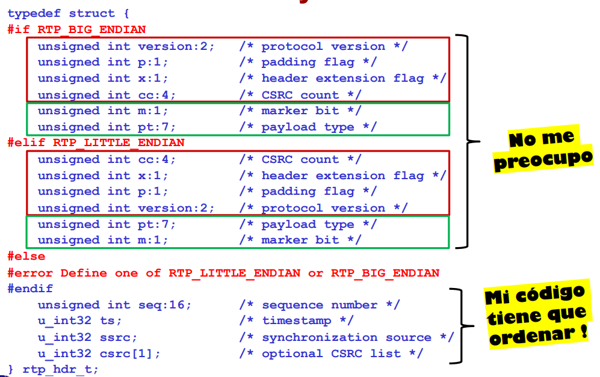
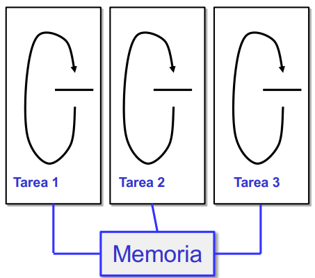
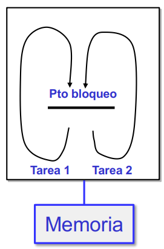

Técnicas de programación de software multimedia
===============================================


# *Byte order*

Existen distintos convenios sobre cómo ordenar el almacenamiento de objetos multibyte (ej. un entero de 2 bytes) en memoria:

- *Big-endian*: byte más significativo delante, en posición de memoria menor.

- *Little-endian*: byte menos significativo delante.

Para el envío de datos por la red en IP, RFC791 dice

- Colocar cantidades en varios octetos con el byte más significativo primero (colocado como *big-endian*).

- Enviar primero los bytes en posiciones de memoria menores

- En cada byte, transmitir primero los bits más significativos

Este convenio se conoce como *network byte order*. Es responsabilidad de la aplicación colocar bien (*big-endian*):

- Estructuras de tamaño mayor que 1 byte

- Bits con sentido posicional dentro de un byte

Un elemento de tamaño mayor a un *byte* tiene que ser ordenado antes de mandarlo:

- Convertir de orden de *host* a *network byte order*:

    ```C
    uint32_t htonl(uint32_t hostlong);
    uint16_t htons(uint16_t hostshort);
    ```

- Convertir de *network byte order* a orden de *host*:

    ```C
    uint32_t ntohl(uint32_t netlong);
    uint16_t ntohs(uint16_t netshort);
    ```

Notar los tipos de datos: `uint16_t` o `uint32_t`.

El uso de estas funciones hace que el código que generemos sea portable:

- El compilador decide al implementar la función cómo se colocan los bytes en función de la arquitectura del *host*.

- Un código que llame a estas funciones siempre lo hace bien.




# Arquitectura de una aplicación multimedia

Requisitos de la aplicación:

- Varias tareas distintas:
    - Que pueden activarse en momentos indeterminados.
    - Que requieren atención inmediata (o se degrada la calidad).

- Código sencillo.

Un código con un único hilo de ejecución junto con operaciones de entrada/salida bloqueantes no resuelve el problema.

Aunque nuestra aplicación atiende a un solo "cliente", estos requisitos son comunes a aplicaciones que atienden a muchos clientes. Cuando hay muchos clientes, se añade requisito de eficiencia en uso de CPU y recursos (atender al mayor número de clientes con el menor coste).

Los SO ofrecen herramientas alternativas para solucionar este problema:

- Soporte para múltiples hilos de ejecución (procesos, threads).

- Entrada salida no bloqueante.

- Entrada salida asíncrona.

- Multiplexación de entrada/salida.

## Caso 1: Múltiples hilos de ejecución con entrada/salida bloqueante

Requiere la gestión del acceso exclusivo a memoria.



## Caso 2: Múltiples hilos de ejecución con entrada/salida no bloqueante

Se configura un dispositivo para que las llamadas (read, write, etc.) retornen inmediatamente con los datos o con indicación (error) de que no había datos. Por ejemplo:

```C
int flags = fcntl(fd, F_GETFL, 0);
fcntl(fd, F_SETFL, flags | O_NONBLOCK);
```

Tendremos llamadas no bloqueantes en un código que itera continuamente en todos los eventos deseados (*busy waiting* o espera activa), lo que conlleva un gran consumo de CPU.

## Caso 3: Múltiples hilos de ejecución con entrada/salida asíncrona

Las operaciones de entrada y salida se hacen en una comunicación con el SO en dos fases:

- Solicitud de la operación.

- Completar operación cuando hay datos/espacio (por ejemplo, un código que se activa como consecuencia de una señal).

Se puede implementar, por ejemplo, con las llamadas `aio_read()`, `aio_write()`, etc.

Es crecientemente popular pero puede ser complejo de programar.

## Caso 4: Un único hilo de ejecución con bloqueo en punto único para múltiples operaciones de entrada/salida (multiplexación)

Es sencillo de programar y eficiente. Se implementa con las llamadas `select()`, `poll()`.



### Llamada `select()`

`select()` se bloquea hasta que pasa alguno de los siguientes eventos:

- Alguno de entre varios descriptores esté en disposición de ser leído o ser escrito. Un descriptor puede referirse a un dispositivo (tarjeta de sonido) o un *socket*.

    ```C
    descriptorTarjetaSonido = open ("/dev/dsp", O_RDWR);
    ```

- Vence un temporizador asociado al `select()`.

El objetivo de una arquitectura con `select()` es que el proceso sólo se bloquee en el `select()` y no en ninguna operación `read` o `write` que se haga como consecuencia del `select()`. De esa forma, la aplicación responderá inmediatamente a cualquier evento.

#### Definición

```C
#include <sys/time.h>
#include <sys/types.h>
#include <unistd.h>

/* definición función select */
int select(int n,
    fd_set *conjunto_lectura, /*conjunto de descriptores esperando en lectura*/
    fd_set *conjunto_escritura, /*conjunto de descriptores esperando en
    escritura*/
    fd_set *conjunto_excepciones, /*conjunto de descriptores esperando una
    excepción*/
    struct timeval *timeout /* temporizador */
);
```

#### Ejemplo de uso 1

```C
/* Ej: generar conjunto de descriptores para poder esperar en lectura la
llegada de datos en el descriptor 5 o en el 8. Esperamos como máximo 10 s a
alguno de los eventos anteriores*/

fd_set conjunto_lectura;
struct timeval tiempo;

/* programar la espera de 10 segundos */
tiempo.tv_sec = 10;
tiempo.tv_usec = 0;

/* configurar el conjunto de lectura */
FD_ZERO(&conjunto_lectura); /* borro cualquier resto que pudiera haber en la
variable */
FD_SET(5, &conjunto_lectura); /* añado el descriptor número 5 al conjunto –
este numero es un ejemplo! */
FD_SET(8, &conjunto_lectura); /* añado el descriptor número 8 al conjunto */

if ((res = select (FD_SETSIZE, &conjunto_lectura, NULL, NULL, &tiempo)) <0)
{/* error */};
```

Compruebo el resultado (`res`) para saber qué pasó en el `select()`:

```C
if (res <0) { /* error – gestionarlo */ }
else if (res == 0) { /* han pasado los 10 segundos y ha vencido el timer */ }
else { /* en res queda el número de eventos exitosos*/
    if ( FD_ISSET (5, &conjunto_lectura) == 1)
    { /* han llegado datos en el descriptor 5 */ }
    if ( FD_ISSET (8, &conjunto_lectura) == 1)
    { /* han llegado datos en el descriptor 8 */ }
}
```

Hay que comprobar todos los casos programados porque, al salir del `select()`, pueden haberse cumplido varios.

Si se vuelve a llamar a select (por ejemplo, dentro de un while), hay que:

1. Volver a poner a cero los conjuntos (`conjunto_lectura`, etc.):

    ```C
    FD_ZERO(&conjunto);
    ```

2. Añadir elementos a cada conjunto:

    ```C
    `FD_SET(desc, &conjunto);
    ```

3. Actualizar el temporizador.

#### Ejemplo de uso 2

```C
fd_set conjunto_lectura, conjunto_escritura;

/* configurar el conjunto de lectura */
FD_ZERO(&conjunto_lectura); /* borro cualquier resto que pudiera haber en la
variable */
FD_SET(5, &conjunto_lectura); /* añado el descriptor número 5 al conjunto */
FD_ZERO(&conjunto_escritura); /* borro cualquier resto que pudiera haber en la
variable */
FD_SET(3, &conjunto_escritura); /* añado el descriptor número 3 al conjunto */

res = select (FD_SETSIZE, &conjunto_lectura, &conjunto_escritura, NULL, NULL));
if (res <0) { /* error – gestionarlo */ }
else { /* en res queda el número de eventos exitosos*/
    if ( FD_ISSET (5, &conjunto_lectura) == 1)
    { /* han llegado datos en el descriptor 5 */ }
    if ( FD_ISSET (3, & conjunto_escritura) == 1)
    { /* En este ejemplo, nunca ocurre, pero no da error */ }
```

#### ¿Cuándo se desbloquea un `select()`?

Si `select()` se bloquea en lectura en un *socket*, retorna cuando el *socket* esté dispuesto para entregar datos:

- Ha llegado un paquete UDP.

- Ha llegado información TCP  y el nivel TCP la quiere pasar a los niveles superiores.

¿Cómo despertar a un select en lectura a la tarjeta de sonido? Al llamar al `select()`, el sistema operativo no sabe cuántos datos queremos (eso lo sabremos en la operación `read`). `select()` "despierta" cuando la tarjeta ha llenado 1 fragmento. Como queremos que la aplicación sólo se bloquee en `select()`, no en `read`, deberemos ajustar el tamaño del fragmento a los datos que pedimos en `read`, es decir, si el `read` ejecutado después de un `select()` pide dos fragmentos, se bloquea, porque hay 1 fragmento.

Para la escritura en la tarjeta de sonido con `select()`, si `select()` se bloquea porque la tarjeta está llena de datos para ser escritos, se desbloquea cuando hay libre 1 fragmento.

#### Granularidad del temporizador

El temporizador de `select()` tiene también una granularidad limitada. Por ejemplo, tomemos el siguiente código:

```C
for (i=0; i<10; i++) {
    select_time.tv_sec = 0;
    select_time.tv_usec = 100; /* 100 microseconds */
    res = select(FD_SETSIZE, NULL, NULL, NULL, &select_time);
}
```

El tiempo en segundos en el que `select()` está dormido será:

```bash
0.007660
0.000479
0.001073
0.000839
0.001296
0.000980
0.002808
0.002059
0.001338
0.005024
```

También es un error configurar el temporizador con valores de tiempo negativos.

#### Señales y `select()`

Para integrar el procesado de señales con `select()`:

1. Asignamos a las señales un descriptor de fichero:

    ```C
    sigset_t sigInfo;
    sigemptyset(&sigInfo);
    sigaddset(&sigInfo, SIGINT);
    int signal_fd = signalfd(-1, &sigInfo, 0);
    if (signal_fd < 0) { /* ERROR */ }
    ```

2. Bloqueamos la señal para que no interrumpa

    ```C
    if (sigprocmask(SIG_BLOCK, &sigInfo, NULL) < 0) { /* Error*/ }
    ```
    El resultado es que la señal ya no interrumpe en cualquier lugar, en el `select()` miraremos explícitamente si estaba activa.

3. Para detectar en el `select()` si se activó una señal:
- Incluimos el descriptor de la señal en el conjunto de lectura:

    ```C
    FD_SET(signal_fd, &conjunto_lectura);
    ```
- Después del `select()` chequeamos con `FD_ISSET` si ocurrió.

Esta forma de tratar las señales es muy segura.


# Comunicaciones

Programamos con *sockets*, herramienta estándar de comunicaciones con Linux/Unix. Recuerde el requisito de RFC 4961 para RTP y RTCP: puerto UDP de origen y destino igual.

## Repaso de *sockets*

### Creación de *sockets*

...

### Definiendo dirección y puerto I: `struct sockaddr_in`

...

### `bind`

...

### Definiendo dirección y puerto II: `struct sockaddr`

...

### `sendto`

Después de haber hecho `bind`, para enviar datos podemos utilizar:

```C
ssize_t sendto(int sock_id,
    const void *msg,
    size_t msg_len,
    int flags,
    const struct sockaddr *dest,
    socklen_t dest_len);
```

Donde:

- `*msg`: Datos en zona contigua de memoria, resultado de `malloc` o `char buffer[tamanho]`.

- `msg_len`: Tamaño de los datos.

- `dest`: Indica dirección IP y puerto del nodo remoto al que se manda el paquete.

- `flags`: Permite indicar opciones de envío, podemos poner a 0.

Uso:

```C
datosEnviados = sendto (
    sock_id,
    msg,
    msg_len,
    0,
    (struct sockaddr *)&dest,
    sizeof (struct sockaddr_in) 
);
```

### `recvfrom`

Después de haber hecho `bind`, para recibir datos podemos utilizar:

```C
ssize_t recvfrom(int sock_id,
    void *msg,
    size_t msg_len,
    int flags,
    struct sockaddr *from,
    socklen_t *from_len);
```

Donde:

- Los datos los deja de forma contigua en la posición de memoria que empieza en `msg`. Esa zona puede haberse creado con `malloc` o como `char buffer[tamanho]`.

- `msg_len`: Antes de la llamada, debe contener el tamaño de memoria reservado para dejar los datos.

- Retorna el tamaño en bytes del paquete UDP recibido. Puede ser menor, igual o mayor (si es mayor, sólo se copió en `msg` la cantidad de datos de `msg_len`).

- `flags`: Varias opciones, a 0 nos vale.

Al retornar la función, en `from` queda la dirección y puerto remotos del paquete recibido (dirección y puertos de fuente). No importan los valores que tenía `from` antes de llamar `recvfrom`.

Antes de llamar a `recvfrom` hay que rellenar la variable `from_len`:
```C
from_len = sizeof (struct sockaddr_in);
```
De esta forma, `recvfrom` sabe cuántos datos puede escribir a partir de la posición de memoria definida por `from`.

El uso combinado de `bind` y `recvfrom` puede recibir paquetes enviados desde cualquier origen, no se filtran paquetes por la IP del remoto ni el puerto remoto de los datos. Si quiero filtrar (por ejemplo, para escuchar sólo paquetes que vengan de IP x.y.z.k), necesito otras herramientas, como `connect`.

Es necesario distinguir entre protocolo orientado a conexión y no orientado a conexión. `connect` es una "herramienta de programación", no un modelo de protocolo.

`sendto` y `recvfrom` no son la única forma de enviar y recibir. Para *sockets* "conectados" se puede utilizar `read` y `write` (además de otras formas), pero `sendto` y `recvfrom` tienen ventajas para los requisitos de nuestro programa:

- Multicast.

- Poder recibir de cualquier nodo remoto.

- Puertos simétricos.

## Configuraciones especiales del socket

...


### Multicast

...

### Reutilización de puertos

...

### No recibir copia de mensajes que manda el mismo nodo

...

## Delimitación de datos en UDP

...


# Programando y depurando

## Programando

...

### Uso del comando `man`

...

## Depurando

### Uso de `strace`

Le permite ver la secuencia de llamadas al sistema operativo, los parámetros, si tienen éxito o fallan y una indicación de por qué. Es útil al depurar `recvfrom`, `sendto`, ...

Sus parámetros son:

- `-o fichero`: Vuelca la información a un fichero.
- `-tt`: Muestra el instante de tiempo en el que se ejecuta una operación. Es útil para depurar temporizaciones.

#### Ejemplo de salida de `strace`

```bash
doc010:~/larc> strace -x ./host1

mprotect(0xb7f96000, 4096, PROT_READ) = 0
munmap(0xb7f9c000, 147212) = 0
socket(PF_INET, SOCK_DGRAM, IPPROTO_IP) = 3
bind(3, {sa_family=AF_INET, sin_port=htons(5000), sin_addr=inet_addr("0.0.0.0")}, 16) = 0
sendto(3, "Sent from host1\0"..., 16, 0, {sa_family=AF_INET, sin_port=htons(5000), sin_addr=inet_addr("239.0.1.1")}, 16) = 16
fstat64(1, {st_mode=S_IFCHR|0620, st_rdev=makedev(136, 12), ...}) = 0
mmap2(NULL, 4096, PROT_READ|PROT_WRITE, MAP_PRIVATE|MAP_ANONYMOUS, -1, 0) = 0xb7fbf000
write(1, "Host1: Using sendto to send data "..., 58Host1: Using sendto to send data to multicast destination) = 58
recvfrom(3, "Sent from host2\0"..., 256, 0, {sa_family=AF_INET, sin_port=htons(5000), sin_addr=inet_addr("163.117.144.141")}, [16]) = 16
```

En la tercera línea podemos ver:

- `socket` -> Nombre de la llamada.
- `PF_INET, SOCK_DGRAM, IPPROTO_IP` -> Valores de los argumentos. En este caso son constantes "bien conocidas" (conocidas también por `strace`).
- `3` -> Resultado de la llamada (ver `man 3 socket`).


Sobre la conexión, podemos ver:

- Socket UDP abierto:
    - Tercera línea: `SOCK_DGRAM` y valor `3`.
- Llamada a `bind`:
    - Cuarta línea: se usa valor `3`.
- Envía a dirección *multicast* y puerto destino 5000:
    - Quinta línea: `sin_port=htons(5000)`, `sin_addr=inet_addr("239.0.1.1")`, se usa valor `3`.
    - Octava línea: `write(1, "Host1: Using sendto to send data "..., 58Host1: Using sendto to send data to multicast destination) = 58`.
- Recibe de puerto remoto 5000 y dirección remota 163.117.144.141:
    - Novena línea: se usa valor `3`, `sin_port=htons(5000)`, `sin_addr=inet_addr("163.117.144.141")`.

###  Llamada a `select` en `strace`

```
select(1024, [3 4], [4], NULL, {3, 200}) = 1 (in [4], left {2, 984123})
```

La parte de la izquierda son los valores de los argumentos antes de la llamada:

- `1024` -> `FD_SETSIZE`.
- `[3 4]` -> Configurado inicialmente para esperar datos en lectura de descriptor 3 y 4.
- `[4]` -> Configurado inicialmente para esperar datos en escritura del descriptor 4.
- `{3, 200}` -> Retorna en 3 segundos 200 microsegundos si en este tiempo no llegó nada en lectura a 3 o 4 ó se pudo escribir en 4.
- `1` -> Hubo éxito en una de las cosas que se pidió.

La parte de la derecha son los valores de los argumentos después de la llamada:

- `in [4]` -> Hay datos en lectura (`in`) del descriptor 4.
- `{2, 984123}` -> Este (2 segundos y 984123 microsegundos) es el valor que tenía el temporizador en el momento de salir de la llamada.

###  Lectura y escritura en `strace`

Podemos ver los valores leídos/escritos por las llamadas:

```
read(3, "~~\201\204\205\210\212\213\215\216\217\221\220 \222\222\222\223\224\223\221\214\206\210\204\177~xstqpo". .., 128) = 12
```
Si los valores están dentro del rango de caracteres ASCII, lo interpreta como caracteres imprimibles. Si no, y no hay *switch* (como `–x`) imprime valores en formato octal (`\201\204...`).

Es mejor llamar con `strace –x`, para que muestre valores en hexadecimal.


### Consejos de programación en C y Unix

#### Posibles causas de `Segmentation Fault`

...

#### Buscando una función (o una declaración de una estructura...)

...

#### Orden de depuración

...

### Uso de `valgrind` (depuración de problemas de memoria dinámica)

*Valgrind* permite comprobar el uso de memoria de *heap*, por lo que es una herramienta muy utilizada en muchos proyectos.

Para usarla:

- Compile código que quiere depurar con –g

- Ejecute código como:
    ```bash
    valgrind --tool=memcheck --leak-check=full --show-leak- kinds=all sucodigo`
    ```

Por ejemplo:
```bash
valgrind --tool=memcheck --leak-check=full --show-leak- kinds=all ./vitextserver ../videos/1.vtx 239.0.1.23
```

*Valgrind* identifica:

- Punteros que acceden a zonas de memoria no reservada (por ejemplo, cuando se escriben más datos del tamaño reservado).

- Memoria que no se libera

No comprueba el acceso a *arrays* fuera de rango.

### Para ser software profesional faltaría...

...

### Tests

...