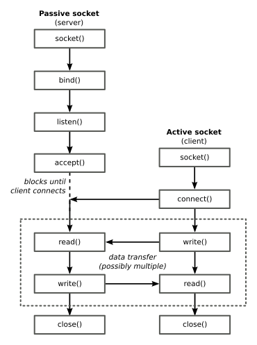

Socket notes
============


# Index

1. [Basics](#basics)
	- [Machine types](#machine-types)
	- [C libraries from socket API](#c-libraries-from-socket-api)

2. [Structures](#structures)
	- [Socket address structure](#socket-address-structure-sockaddr_in)
	- [Socket address structure for IPv6](#socket-address-structure-for-ipv6-sockaddr_in6)
	- [Socket address storage](#socket-address-storage-sockaddr_storage)
	- [Internet address structure](#internet-address-structure-in_addr)
	- [Internet address structure for IPv6](#internet-address-structure-for-ipv6-in6_addr)
	- [Host structure](#host-structure-hostent)
	- [Address information structure](#address-information-structure-addrinfo)

3. [Main calls and functions](#main-calls--functions)
	- [Conversion functions](#conversion-functions)
	- [Addressing and networking](#addressing-and-networking)
	- [Socket usage](#sockets-usage)
	- [Thread management](#thread-management)


# Basics

## Machine types



### Pasive socket (server)

```
socket()

bind()

listen()

accept()

loop{
	read()
	write()
}

close()
```

### Active socket (client)

```
socket()

connect()

loop{
	read()
	write()
}

close()
```

## C libraries from socket API

```C
#include <sys/types.h>
#include <sys/socket.h>
#include <fcntl.h>
#include <sys/time.h>
#include <unistd.h>
```


# Structures

## Socket address structure (`sockaddr_in`)

### Introduction

This structure is used to store the information related to an addressed point (host, address and port) we want to reach. Is the main structure for socket programming in IPv6.

### Description

```C
struct sockaddr_in{
	
	u_char sin_len;				/* Total length. */
	sa_family_t sin_family;		/* Address family. We will use the value AF_INET for IPv4 and AF_INET6 for IPv6. It can be u_short or sa_family_t data type. */
	in_port_t sin_port;			/* Port number. It can be u_short or in_port_t data type. */
	struct in_addr sin_addr;	/* IP address in Internet address format (chech "Internet address structure" below, it only consists on a 32-bit or 4 bytes data block). */
	char sin_zero;				/* Not used. We set it to 0. */
}
```

`sin_len`: Total length.

`sin_family`: Address family. We will use the value `AF_INET` for IPv4 and `AF_INET6` for IPv6. It can be `u_short` or `sa_family_t` data type.

`sin_port`: Port number. It can be `u_short` or `in_port_t` data type.

`sin_addr`: IP address in Internet address format (chech "Internet address structure" below, it only consists on a 32-bit or 4 bytes data block).

`sin_zero`: Not used. We set it to `0`.

### Steps and indications for `sockaddr_in` struct usage (we use an example of IPv4)

1. Values selection:
```C
/* A string with an IP address in dotted format or a hostname */
char *host = "<IP address>";

/* A string with a port */
char *port = "<port>";
```

2. Structs declaration:
```C
/* The "sockaddr_in" struct we are going to fill. */
struct sockaddr_in sin;

/* A pointer to a "hostent" structure (see "Host structure" below) to manage IP addresses and DNS names. */
struct hostent *phe;
```

3. Variable assignation:
```C
/* Erase (reset) the "sockaddr_in" struct with zeroes. */
memset(&sin, 0, sizeof(sin));

/* AF_INET is the address family that is used for the socket we are creating (in this case an Internet Protocol address). */
sin.sin_family = AF_INET;

/* Assign port number to connect (client) or bind (server). Notice that we are casting from string to integer ("atoi" function) and then to u_short type so we can finally convert to network order. */
sin.sin_port = htons((u_short)atoi(port));

/*
We make a DNS request to find the IP address of the hostname. If we have a response, the IP address of the hostname is stored in the "h_addr" value of "hostent" structure with the proper format (integer sequence in network order). If "gethostbyname()" doesn't return a success value, we may assign the initial address (char *host) after converting it to the same format as "h_addr" with "inet_addr()".
*/
if( phe = gethostbyname(host) ) memcpy(&sin.sin_addr, phe->h_addr, phe->h_length);
else if ( (sin.sin_addr.s_addr = inet_addr(host)) == INADDR_NONE ) errexit("can't get \"%s\" host entry\n", host);
```

4. Getting back and printing an IP address in string format:
```C
char *ip = inet_ntoa(sin.sin_addr);
printf("The IP address of the socket is: %s\n",ip);
```

## Socket address structure for IPv6 (`sockaddr_in6`)

### Introduction

This structure is used to store the information related to an addressed point (host, address and port) we want to reach. Is the main structure for socket programming in IPv6.

### Description

```C
struct sockaddr_in6{
	
	sa_family_t sin6_family;	/* Address family. We will use the value AF_INET6 as we are working with for IPv6. It can be u_short or sa_family_t data type. */
	in_port_t sin6_port;		/* Port number. It can be u_short or in_port_t data type. */
	struct in6_addr sin6_addr;	/* IP address in IPv6 Internet address format (chech "Internet address structure for IPv6" below, it only consists on a 128-bit or 16 bytes data block). */
	uint32_t sin6_flowinfo;		/* IPv6 flow information. */
	uint32_t sin6_scope_id;		/* Scope ID (new in 2.4). */
};
```

`sin6_family`: Address family. We will use the value AF_INET6 as we are working with for IPv6. It can be `u_short` or `sa_family_t` data type.

`sin6_port`: Port number. It can be `u_short` or `in_port_t` data type.

`sin6_addr`: IP address in IPv6 Internet address format (chech "Internet address structure for IPv6" below, it only consists on a 128-bit or 16 bytes data block).

`sin6_flowinfo`: IPv6 flow information.

`sin6_scope_id`: Scope ID (new in 2.4).

## Auxiliar socket address structure (`sockaddr`)

### Introduction

The only purpose of this structure is to contain a socket address to be passed as an argument to several calls of the socket API. Used in `addrinfo`.

### Description

```C
#define DATA_LENGTH

struct sockaddr{

	sa_family_t sa_family;		/* Address family. We will use the value AF_INET for IPv4 and AF_INET6 for IPv6. It can be u_short or sa_family_t data type. */
	char sa_data[DATA_LENGTH];	/* Socket address (variable-length data). */
}
```

`sa_family`: Address family. We will use the value `AF_INET` for IPv4 and `AF_INET6` for IPv6. It can be `u_short` or `sa_family_t` data type.

`sa_data`: Socket address (variable-length data).

## Socket address storage (`sockaddr_storage`)

### Introduction

This type is suitable to accommodate all supported domain-specific socket address structures (`sockaddr`, `sockaddr_in`, `sockaddr_in6`). It is large enough to accommodate all supported protocol-specific address structures. It is aligned at a appropriate boundary so that pointers to it can be cast as pointers to protocol-specific address structures and used to access the fields of those structures without alignment problems. It is useful in programs that must handle socket addresses in a generic way.

### Description (as an implementation example for an specific maximum size)

```C
/* Implementation-defined maximum size. */
#define _SS_MAXSIZE 128

/* Implementation-defined desired alignment. */
#define _SS_ALIGNSIZE (sizeof(int64_t))

/* Definitions used for "sockaddr_storage" structure paddings design. */
#define _SS_PAD1SIZE (_SS_ALIGNSIZE - sizeof(sa_family_t))
#define _SS_PAD2SIZE (_SS_MAXSIZE - (sizeof(sa_family_t)+ \_SS_PAD1SIZE + _SS_ALIGNSIZE))

struct sockaddr_storage{
	
	sa_family_t ss_family; /* Address family. */
	
	/* Following fields are implementation-defined. */
	
	char _ss_pad1[_SS_PAD1SIZE];	/* 6-byte pad; this is to make implementation-defined pad up to alignment field that follows explicit in the data structure. */
	int64_t _ss_align;				/* Field to force desired structure storage alignment. */
	char _ss_pad2[_SS_PAD2SIZE];	/* 112-byte pad to achieve desired size, _SS_MAXSIZE value minus size of ss_family, __ss_pad1, __ss_align fields is 112. */
};
```

`ss_family`: Address family.

`_ss_pad1`: 6-byte pad; this is to make implementation-defined pad up to alignment field that follows explicit in the data structure.

`_ss_align`: Field to force desired structure storage alignment.

`_ss_pad2`: 112-byte pad to achieve desired size, `_SS_MAXSIZE` value minus size of `ss_family`, `__ss_pad1`, `__ss_align` fields is 112.

## Internet address structure (`in_addr`)

### Introduction

This structure stores an IPv4 address as a 32-bit number. Used in `sockaddr_in`.

### Description

```C
struct in_addr{
	
	uint32_t s_addr; /* Address in network byte order */
}
```

`s_addr`: Address in network byte order.

## Internet address structure for IPv6 (`in6_addr`)

### Introduction

This structure stores an IPv6 address as an array of 16 8-bit numbers. Used in `sockaddr_in6`.

### Description

```C
struct in6_addr{
	
	unsigned char s6_addr[16]; /* IPv6 address */
};
```

`s6_addr`: IPv6 address.

## Host structure (`hostent`)

### Introduction

This structure is used to manage DNS related host issues. This structure stores information about an internet host. It can be updated using a DNS request.

### Description

```C
struct hostent{
	
	char *h_name;		/* Official name of the host. */
	char **h_aliases;	/* Set of different host names (alias) for this host given in character strings (terminated in a NULL character) */
	int h_addrtype;		/* Address type. */
	int h_length;		/* The length, in bytes, of the address. */
	char **h_addr_list;	/* Set of network addresses (in network byte order) for the host. They are given in character strings terminated in a NULL character. */
}

#define h_addr h_addr_list[0] /* First address of the list for backward compatibility. */
```

`h_name`: Official name of the host.

`h_aliases`: Set of different host names (alias) for this host given in character strings (terminated in a `NULL` character).

`h_addrtype`: Address type.

`h_length`: The length, in bytes, of the address.

`h_addr_list`: Set of network addresses (in network byte order) for the host. They are given in character strings terminated in a `NULL` character.

## Address information structure (`addrinfo`)

### Introduction

This structure consists on a linked list that contains information of a series of addresses.

### Description

```C
struct addrinfo{
	
	int ai_flags;				/* This field specifies additional options. */
	int ai_family;				/* Address family of this node:
									AF_INET: IPv4.
									AF_INET6: IPv6.
									AF_UNSPEC: Any address family.
								*/
	int ai_socktype;			/* Socket type:
									SOCK_STREAM: Stream, typically for TCP.
									SOCK_DGRAM: Datagram, typically for UDP.
								*/
	int ai_protocol;			/* Protocol */
	socklen_t ai_addrlen;		/* Size of "ai_addr" in bytes */
	struct sockaddr *ai_addr;	/* Equivalent information given in a "sockaddr" structure that can be:
									sockaddr_in: IPv4.
									sockaddr_in6: IPv6
								*/
	char *ai_canonname;			/* Full canonical hostname */
	struct addrinfo *ai_next;	/* Pointer to the next item of the linked list. */
};
```

`ai_flags`: This field specifies additional options.

`ai_family`: Address family of this node. It can be:
- `AF_INET`: IPv4.
- `AF_INET6`: IPv6.
- `AF_UNSPEC`: Any address family.

`ai_socktype`: Socket type. It can be:
- `SOCK_STREAM`: Stream, typically for TCP.
- `SOCK_DGRAM`: Datagram, typically for UDP.

`ai_protocol`: Protocol.

`ai_addrlen`: Size of `ai_addr` in bytes.

`ai_addr`: Equivalent information given in a `sockaddr` structure that can be:
- `sockaddr_in`: IPv4.
- `sockaddr_in6`: IPv6

`ai_canonname`: Full canonical hostname.

`ai_next`: Pointer to the next item of the linked list.


# Main calls & functions

## I/O system calls

```C
int open(const char *pathname, int flags);
int open(const char *pathname, int flags, mode_t mode);
```
Prepares a device or file to perform input or output operation

Returned value: It returns an integer (file descriptor) that Will be used in the following calls as a reference to the device or file:
```C
int desc;
desc = open("filename", O_RWDR, 0);
```

---

```C
ssize_t read(int fd, void buf[.count], size_t count);
```
Reads data from the device or file.

---

```C
ssize_t write(int fd, const void buf[.count], size_t count);
```
Writes data on the device or file.

---

```C
int close(int fd);
```
Ends the use of the device or file.

---

```C
int creat(const char *pathname, mode_t mode);
```
It creates a file.

---

```C
off_t lseek(int fd, off_t offset, int whence);
```
It allows to move (*jump*) through a file without reading or writing.

---

```C
int ioctl(int fd, unsigned long request, ...);
```
For device control (buffer size, character table, etc.).

## Conversion functions

```C
uint16_t htons(uint16_t hostshort);
```
Host to network short integer. The `htons()` function converts the unsigned short integer `hostshort` from host byte order to network byte order.

---

```C
uint32_t htonl(uint32_t hostlong);
```
Host to network long integer. The `htonl()` function converts the unsigned integer `hostlong` from host byte order to network byte order.

---

```C
uint16_t ntohs(uint16_t netshort);
```
Network to host short integer. The `ntohs()` function converts the unsigned short integer `netshort` from network byte order to host byte order.

---

```C
uint32_t ntohl(uint32_t netlong);
```
Network to host short integer. The `ntohl()` function converts the unsigned integer `netlong` from network byte order to host byte order.

---

```C
int atoi(const char *nptr);
```
The `atoi()` function converts the initial portion of the string pointed to by `nptr` to int. The behavior is the same as:
```C
(int)strtol(nptr, NULL, 10);
```
Except that `atoi()` does not detect errors.

---

```C
long atol(const char *nptr);
```
The `atol()` function converts the initial portion of the string pointed to by `nptr` to long. The behavior is the same as:
```C
strtol(nptr, NULL, 10);
```
Except that `atol()` does not detect errors.

---

```C
long long atoll(const char *nptr);
```
The `atoll()` function converts the initial portion of the string pointed to by `nptr` to long long. The behavior is the same as:
```C
strtoll(nptr, NULL, 10);
```
Except that `atoll()` does not detect errors.

---

```C
const char *inet_ntop(int af, const void *src, char *dst, socklen_t size);
```
This function converts a network address structure from binary to text form, this is, a character string.

`af`: Address family that we are using. It can be:
- `AF_INET`: IPv4.
- `AF_INET6`: IPv6.

`src`: Pointer to the network address structure that we want to convert.

`dst`: Pointer to the buffer where the resulting string is copied. It must be a non-null pointer.

`size`: Number of bytes available in this buffer must be specified in this argument.

---

```C
int inet_aton(const char *cp, struct in_addr *inp);
```
This function converts the Internet host address `cp` from the IPv4 numbers-and-dots notation into binary form (in network byte order) and stores it in the structure that `inp` points to. `inet_aton()` returns nonzero if the address is valid, zero if not. The address supplied in `cp` can have one of the following forms:
- `a.b.c.d`: Each of the four numeric parts specifies a byte of the address.
- `a.b.c`: Parts a and b specify the first two bytes of the binary address. Part c is interpreted as a 16-bit value.
- `a.b`: Part a specifies the first byte of the binary address. Part b is interpreted as a 24-bit value.
- `a`: The value a is interpreted as a 32-bit value that is stored directly into the binary address without any byte rearrangement.

---

```C
in_addr_t inet_addr(const char *cp);
```
This functions converts the Internet host address `cp` from IPv4 numbers-and-dots notation into binary data in network byte order. If the input is invalid, `INADDR_NONE` (usually `-1`) is returned. Use of this function is problematic because `-1` is a valid address (`255.255.255.255`).

---

```C
in_addr_t inet_network(const char *cp);
```
This function function converts `cp`, a string in IPv4 numbers-and-dots notation, into a number in host byte order suitable for use as an Internet network address. On success, the converted address is returned. If the input is invalid, `-1` is returned.

---

```C
char *inet_ntoa(struct in_addr in);
```
This function converts the Internet host address `in`, given in network byte order, to a string in IPv4 dotted-decimal notation. The string is returned in a statically allocated buffer, which subsequent calls will overwrite.

---

```C
struct in_addr inet_makeaddr(in_addr_t net, in_addr_t host);
```
This function returns an Internet host address as a `in_addr` structure, created by combining the network number `net` with the local address `host`, both in host byte order.

---

```C
in_addr_t inet_lnaof(struct in_addr in);
```
This function returns the local network address part of the Internet address `in`. The returned value is in host byte order.

---

```C
in_addr_t inet_netof(struct in_addr in);
```
This function returns the network number part of the Internet address `in`. The returned value is in host byte order.

## Addressing and networking

```C
int getaddrinfo(
	const char *node,
	const char *service,
	const struct addrinfo *hints,
	struct addrinfo **res
);
```
This function returns one or more `addrinfo` structures, each of which contains an Internet address that can be specified in a call to `bind()` or `connect()`, this is, addresses that we can use to create a passive socket or addresses that we can make an active socket connect to. The `getaddrinfo()` function combines the functionality provided by the `gethostbyname()` and `getservbyname()` functions into a single interface, but unlike the latter functions, `getaddrinfo()` is reentrant and allows programs to eliminate IPv4-versus-IPv6 dependencies. The `getaddrinfo()` function allocates and initializes a linked list of `addrinfo` structures, one for each network address that matches `node` and `service`, subject to any restrictions imposed by `hints`, and returns a pointer to the start of the list in `res`. The items in the linked list are linked by the `ai_next` field.

`node`: This argument identifies an Internet host.

`service`: This argument identifies an Internet service. It sets the port in each returned address structure. If this argument is a service name, it is translated to the corresponding port number. If service is `NULL`, then the port number of the returned socket addresses will be left uninitialized.

`hints`: Pointer to an `addrinfo` structure that specifies criteria for selecting the `addrinfo` structures returned in the list pointed to by `res`. Criteria that limit the set of socket addresses returned by `getaddrinfo()` are the following values from `hints`:
- `ai_flags`: This field specifies additional options. Multiple flags are specified with `&` and `|` operators, which impose both or any of the flags, respectivelly. Valid values for this field are:
	- `AI_V4MAPPED | AI_ADDRCONFIG`: It indicates that `getaddrinfo()` should return socket addresses of any type that flags can impose.
	- `AI_NUMERICHOST`: It suppresses any potentially lengthy network host address lookups.
	- `AI_PASSIVE`: The returned socket addresses will be suitable for binding a socket that will accept connections. If this flag is not set, the returned socket addresses will be suitable for use with connect(). Must be used with a `NULL` value for `node`.
	- `INADDR_ANY`: We select IPv4 when a `wildcard address` is going to be returned.
	- `IN6ADDR_ANY_INIT`: We select IPv6 when a `wildcard address` is going to be returned.
	- `INADDR_LOOPBACK`: We select IPv4 when the network address is set to the loopback interface address.
	- `IN6ADDR_LOOPBACK_INIT`: We select IPv4 when the network address is set to the loopback interface address.
- `ai_family`: This field specifies the desired address family for the returned addresses. Valid values for this field are:
	- `AF_INET`: IPv4.
	- `INET6`: IPv6.
	- `AF_UNSPEC`: It indicates that `getaddrinfo()` should return socket addresses for any address family that can be used with node and service.
- `ai_socktype`: This field specifies the preferred socket type. Valid values for this field are:
	- `SOCK_STREAM`: Stream, typically for TCP.
	- `SOCK_DGRAM`: Datagram, typically for UDP.
	- `0`: It indicates that socket addresses of any type can be returned by `getaddrinfo()`.
- `ai_protocol`: This field specifies the protocol for the returned socket addresses. Specifying `0` in this field indicates that socket addresses with any protocol can be returned by `getaddrinfo()`.
- `ai_addrlen`: It is set to `0`.
- `ai_addr`: It is set to `NULL`.
- `ai_canonname`: It is set to `NULL`.
- `ai_next`: It is set to `NULL`.
	
`res`: Pointer to the start of the list. There are several reasons why the linked list may have more than one addrinfo structure, including:
- The network host is multihomed, accessible over multiple protocols.
- The same service is available from multiple socket types.
Normally, the application should try using the addresses in the order in which they are returned. The sorting function used within `getaddrinfo()` is defined in RFC 3484.

Return value: It returns `0` if it succeeds, or one of a nonzero error code.

---

```C
void freeaddrinfo(struct addrinfo *res);
```
The `freeaddrinfo()` function frees the memory that was allocated for the dynamically allocated linked list `res` when the function `getaddrinfo()` was used.

---

```C
struct hostent *gethostbyname(const char *name);
```
This function returns a structure of type `hostent` (information about that host) for the given host name. Here name is either a hostname or an IPv4 address in standard dot notation.

`name`: Character string with the name of the host whose information is returned in a `hostent` structure.

Return value: A `hostent` structure with the information of the required host is returned.

## Sockets usage

```C
int socket(int domain, int type, int protocol);
sockfd = socket(int socket_family, int socket_type, int protocol);
```
It creates an endpoint for communication (reserves a socket) and returns a file descriptor that refers to that endpoint. This reservation represents the virtual connection between two machines.

`domain`: It indicates the type of domain (protocol family) the socket will work with. Three types:
- `AF_INET` (to use ARPA from Internet, IPv4, for TCP/IP)
- `AF_INET6` (IPv6, for TCP/IP)
- `AF_UNIX` (UNIX file system, pipe, if we pretend to create sockets for internal communications, inside the OS)
- `AF_PUP` (Xerox Corporation PUP internet)
- `AF_APPLETALK` (Red Appletalk)
- `AF_SNA` (IBM SNA)
- `AF_XNS` (Xerox Network System)

`type`: Communication type (type of socket). We will use two types in this course:
- `SOCK_STREAM` (stream, reliable and ordered, typically for TCP)
- `SOCK_DGRAM` (datagram, unreliable and disordered, keeping the package limits, typically for UDP)
- `SOCK RAW`: (raw, direct access to low-level protocols)

`protocol`: We select a protocol to use with our socket. By writing `0` we use automatic selection (tipically TCP for stream and UDP for datagram)

Return value: It returns a socket descriptor that will be used like a file. If it is `-1`, an error ocurred.

---

```C
int bind(int fd, struct sockaddr *my_addr, int addrlen);
```
It assigns an address an port to a previously created socket for this one to listen and work as a pasive socket. This action is subsequent to `socket()` function (socket is created) and previous to `listen()` one (socket listen to the port).

`fd`: Descriptor returned by `int socket()` to indicate the socket we want to use as a pasive socket.

`my_addr`: Pointer to a `sockaddr` struct to indicate the address to listen to. INADDR_ANY to indicate all available addresses.

`addrlen`: It specifies the size, in bytes, of the address structure pointed to by `my_addr`.

Returned value: It returns `-1` if an error ocurred, like the selected address indicates a port that is already being used.

---

```C
int listen(int fd, int backlog);
```
It marks the socket referred to by `fd` as a passive socket (server), that is, as a socket that will be used to accept incoming connection requests by later using `accept()`.

`fd`: Descriptor returned by `int socket()` to indicate the socket we want to make to listen.

`backlog`: Size of the incoming connections queue. It limitates the number of pending acceptance connections.

Returned value: It returns `-1` if an error ocurred.

---

```C
int accept(int fd, void *addr, int *addrlen);
```
It indicates to a passive socket to accept an incoming connection. Execution will stop in `accept()` until a new connection is established. The order in which connections are accepted by pasive socket is indicated by a queue. When a connection is accepted, a new active socket is created for communication operations with requesting active socket. This is due to the fact that pasive socket only allows us to listen and accept incoming connections, so a new active socket (server communication) is created by pasive socket (server attendance) for each requesting active socket (client). We will use created active sockets in a similar way to how they are used for client to communicate with each of the clients they have been created for.

`fd`: Descriptor returned by `int socket()` to indicate the pasive socket we want to make to accept an incoming connection.

`addr`: Pointer to a `sockaddr` struct in which client information is stored.

`addrlen`: It specifies the size, in bytes, of the address structure pointed to by `addr`.

Returned value: It returns a socket descriptor for the usage of the created active socket.

---

```C
int connect(int fd, struct sockaddr *serv_addr, int addrlen);
```
It connects the indicated socket to the pasive socket specified by an address and a port.

`fd`: Descriptor returned by `int socket()` to indicate the active socket we want to connect to.

`serv_addr`: Pointer to a `sockaddr` struct in which server information (IP address and port) is
stored. This argument specifies what we want our active socket to connect to.

`addrlen`: It specifies the size, in bytes, of the address structure pointed to by `serv_addr`.

Returned value: It returns `-1` if an error ocurred, tipically if there is no server in indicated address/port or there is no connection.

---

```C
ssize_t send(int fd, const void *msg, int len, int flags);
```
It is used with active sockets (both the client ones and those obtained with `accept()` by a server machine) to send a message (sending data), which, obviating the network connections and packets transmission, equals to write in a pipe with the function `write()` (the only difference between `send()` and `write()` is the presence of flags). The `send()` call may be used only when the socket is in a connected state (so that the intended recipient is known).

`fd`: Descriptor returned by `int socket()` to indicate the active socket we want to use to send data.

`msg`: Pointer to the buffer (message) that is going to be sent.

`len`: Size of sent data in bytes.

`flags`: With a zero (`0`) flags argument, `send()` is equivalent to `write()`.

Returned value: It returns the number of bytes written into the network, which can be less than `len`, or `-1` if an error ocurred.

---

```C
ssize_t write(int fd, const void *buf, size_t count);
```
It is used with active sockets (both the client ones and those obtained with `accept()` by a server machine) to send a message (sending data), which, obviating the network connections and packets transmission, equals to write in a pipe. The `write()` call may be used for sending data with sockets only when the socket is in a connected state (so that the intended recipient is known).

`fd`: Descriptor returned by `int socket()` to indicate the active socket we want to use to send data.

`buf`: Pointer to the buffer (message) that is going to be sent.

`count`: Size of sent data in bytes.

Returned value: It returns the number of bytes written into the network, which can be less than `len`, or `-1` if an error ocurred.

---

```C
ssize_t recv(int fd, void *buf, int len, unsigned int flags);
```
It is used with active sockets (both the client ones and those obtained with `accept()` by a server machine) to receive messages from another active socket, which, obviating the network connections and packets transmission, equals to read from a pipe with the function `read()` (the only difference between `recv()` and `read()` is the presence of flags). It may be used to receive data on both connectionless and connection-oriented sockets. If a message is too long to fit in the supplied buffer, excess bytes may be discarded depending on the type of socket the message is received from. If no messages are available at the socket, the receive calls wait for a message to arrive, unless the socket is nonblocking.

`fd`: Descriptor returned by `int socket()` to indicate the active socket we want to use to read data.

`buf`: Pointer to the buffer (message) where we store received information.

`len`: Maximun amount of bytes that we want to read, tipically the size of the buffer.

`flags`: With a zero (`0`) flags argument, `recv()` is generally equivalent to `read()`.

Returned value: It returns the length of the message on successful completion (size of read amout of data in bytes) or `-1` if an error ocurred, like no messages are available at the socket and it is nonblocking.

---

```C
ssize_t read(int fd, void *buf, size_t count);
```
It is used with active sockets (both the client ones and those obtained with `accept()` by a server machine) to receive messages from another active socket, which, obviating the network connections and packets transmission, equals to read from a pipe. It may be used to receive data on both connectionless and connection-oriented sockets. If a message is too long to fit in the supplied buffer, excess bytes may be discarded depending on the type of socket the message is received from. If no messages are available at the socket, the receive calls wait for a message to arrive, unless the socket is nonblocking.

`fd`: Descriptor returned by `int socket()` to indicate the active socket we want to use to read data.

`buf`: Pointer to the buffer (message) where we store received information.

`count`: Maximun amount of bytes that we want to read, tipically the size of the buffer.

Returned value: It returns the length of the message on successful completion (size of read amout of data in bytes) or `-1` if an error ocurred, like no messages are available at the socket and it is nonblocking.

---

```C
int fcntl(int fd, int cmd, ... /* arg */ );
```
The `fcntl()` function is a control function that allows us to perform different operations on descriptors (file, socket, etc.).

Associated to each descriptor there is a set of flags that provide information about it. With the `fcntl()` function we can:
- Obtain the value of these flags by setting the `cmd` parameter to `F_GETFL`.
- Modify the value of these flags by setting the `cmd` to `F_SETFL`. We can indicate that the input/output operations on a given socket descriptor are non-blocking by setting the `O_NONBLOCK` flag. This flag is set as follows:
	```C
	int flags;
	// "sd" is the socket descriptor
	if ( fcntl(sd, F_SETFL, O_NONBLOCK) < 0 ) perror("fcntl: could not set non-blocking operations");
	```

We now know how to ensure that input/output operations are non-blocking, but how can we know when data or space is available? When an input/output operation on a non-blocking socket cannot be completed, the call to the input/output function returns an error code (`-1`) and assigns the value `EWOULDBLOCK` to the variable `errno` (recall that it is always necessary to check the number of bytes returned by these calls, since it does not always coincide with the number of bytes that we wanted to read or write). In order to find out when there is data available to be read, a polling mechanism, by which the socket is regularly checked to see if data has arrived, is often used. Each time the socket is polled, if no data is available other tasks can be carried out.

The SIGIO signal is generated when the state of a socket changes, for example:

*New data is available in the input buffer, so that new read operations can now be performed, or space has been freed in the output buffer, so that new write operations can now be performed. A new client wishes to connect. In order for the `SIGIO` signal to be generated, the following calls to the `fcntl()` function must be made on the corresponding socket (sd in the following):*

	```C
	if ( fcntl(sd, F_SETFL, O_ASYNC | O_NONBLOCK) < 0 ) {
		perror("fcntl error");
	}

	if ( fcntl(sd, F_SETOWN, getpid()) < 0 ) {
		perror("fcntl error");
	}
	```

*Asynchronous mechanisms use the occurrence of this signal to know when data is available, enabling other tasks to be carried out while no data is received. As we saw in the previous lab session, a signal handler for a given signal is a function specifying the actions to be carried out when that signal occurs. The `SIGIO` signal handler will perform operations of the type: read any data available in the input buffer of the socket, send any data that the application is waiting to send via the socket, accept any new clients that wish to establish to establish a connection.*

---

```C
int select(
	int nfds,
	fd_set *readfds,
	fd_set *writefds,
	fd_set *exceptfds,
	struct timeval *timeout
);
int select(
	int nfds,
	fd_set *_Nullable restrict readfds,
	fd_set *_Nullable restrict writefds,
	fd_set *_Nullable restrict exceptfds,
	struct timeval *_Nullable restrict timeout
);
```
Usually, various clients connect to a server program simultaneously. To enable our server program to handle simultaneous connections, we have two options:
1. Create a new process or thread for each new connection as we saw in the last lab session.
2. Use the `select()` function, which we now look at in detail.

The `select()` function allows several sockets to be checked at the same time. It is used to know which of the sockets being handled by our program are ready to read or write data, which have received a new connection, which have generated an exception, etc.

The parameters of the function are:
- `nfds`: It is the value of the highest value socket descriptor plus one. Recall that a descriptor is an integer returned when a file, socket, or similar is opened. In the usual case, the values assigned to these descriptors are consecutive.
- `readfds`: It is a pointer to the set of descriptors for which we wish to be notified when data is available to be read. We will also be notified when there is a new client or when a client closes the connection.
- `writefds`: It is a pointer to the set of descriptors for which we wish to be notified when we can write to them without any problem. If the connection has been closed by the other side and we try to write to it, we will receive the `SIGPIPE` signal.
- `exceptfds`: It is a pointer to the set of descriptors for which we wish to be notified when an exception has occurred.
- `timeout`: It is the maximum time that we wish to wait. A `NULL` value indicates that the call to `select()` is to remain blocked until something occurs on one of the descriptors. A zero value indicates that we wish to know if something has occurred on one of the descriptors without blocking.

The function returns:
- `-1` if an error occurs (see `errno`)
- `0` if the timer expires
- A number greater than zero (the number of descriptors in the descriptor set) if the call succeeds.

`fd_set` is the type of the descriptor set. Variables of this type are manipulated using macros. Suppose we have defined the descriptor set as `set`:
```C
fd_set set;
```
Then:
- `FD_ZERO(&set)` initialises (and deletes) the set of descriptors.
- `FD_SET(fd, &set)` adds a new descriptor to the set
- `FD_CLR(fd, &set)` removes a descriptor from the set.
- `FD_ISSET(fd, &set)` returns a number greater than zero if the descriptor `fd` is a member of the set. This macro can be used to find out if there is data available on `fd` after a call to `select()`.

## Thread management

```C
int pthread_create(pthread_t *thread, const pthread_attr_t *attr, void *(*start_routine) (void *), void *arg);
```
It creates a new thread.

Returned value: On success, it returns `0`. On error, it returns an error number.

---

```C
int pthread_join(pthread_t thread, void **retval);
```
It makes a thread to wait for another.

Returned value: On success, it returns `0`. On error, it returns an error number.

---

```C
int pthread_mutex_lock(pthread_mutex_t *mutex);
```
This function (and similar) let us to create a mutex semaphore, allowing us to make several threads to have access to a common resource in a synchronized way.

---

```C
void pthread_exit(void *retval);
```
It terminates the thread.